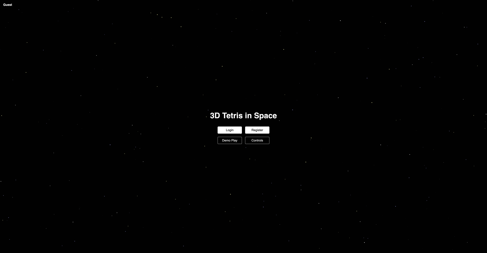
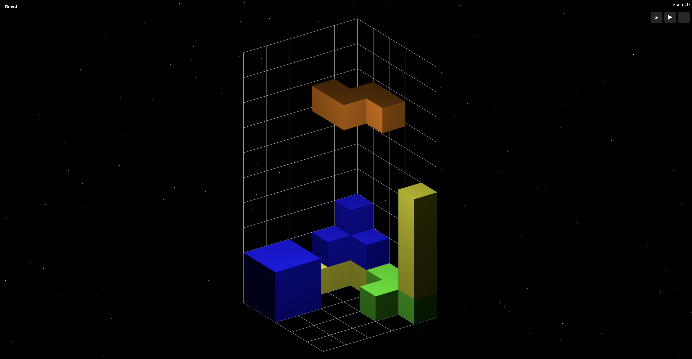

# 3D Tetris in Space (WebGL + Spring Boot)

3D Tetris game built with WebGL and JavaScript, backed by a Spring Boot API for authentication, user accounts, and persistent high scores.

## Systems

#### Game (WebGL)
- 3D rendering using WebGL and GLSL shaders
- Game logic and scoring system

#### Backend
- REST API for authentication and score handling
- JWT-based authentication
- Persistent storage of users and high scores

#### Client–Server Interaction
- Frontend communicates with backend via HTTP (fetch + JWT)
- Authenticated users can submit and update scores
- Leaderboard data fetched and rendered dynamically

## Architecture

Frontend (WebGL) → REST API (Spring Boot) → Database

## How to Run Locally  

#### Frontend   
- Open `index.html` in Chrome **or** run via Live Server in VS Code.   

#### Backend  
- run Spring Boot app (default: localhost:8080)
- configure DB in application.properties

## Technologies  

- WebGL, GLSL, JavaScript
- Spring Boot, Spring Security, JWT
- JPA / Hibernate 
